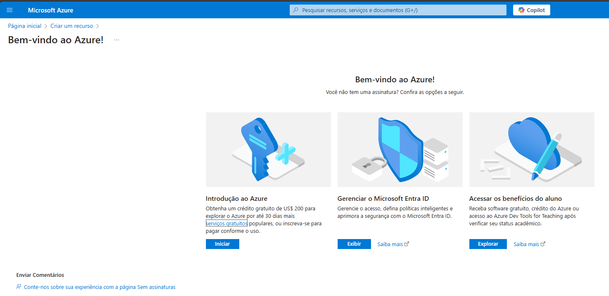

# 🧪 Teste de Bot de Fala com Azure Cognitive Services

Este repositório foi criado para testar a funcionalidade de **conversão de texto em fala (Text-to-Speech)** oferecida pela plataforma **Microsoft Azure**, através do serviço **Cognitive Services**.

---

## 🎯 Objetivo

Realizar um teste prático com o **serviço de fala do Azure**, verificando a qualidade, acessibilidade e facilidade de uso da API, conforme instruído no curso.

---

## ❗ Problema Encontrado

Durante o processo de teste, foi identificado que a funcionalidade de bot de fala que antes era gratuita, **agora está disponível apenas para contas pagas**.

🛑 **Resultado:** Não foi possível realizar o teste sem uma assinatura paga.

---

## 🖼️ Captura de Tela

Abaixo, uma imagem ilustrando a limitação encontrada:

---

## 📚 Tecnologias e Recursos

- [x] Microsoft Azure
- [x] Cognitive Services (Text-to-Speech)
- [ ] Teste de Voz (não concluído por limitação)

---

## 🚧 Status do Projeto

> ❌ **Teste não realizado** devido a mudanças na política de acesso da Microsoft.  
> ✅ Repositório mantido como registro e documentação da tentativa.

---

## 💡 Observações

Se você possui uma conta paga no Azure, ainda pode seguir os mesmos passos do curso e utilizar os recursos de bot de fala.

---

## 📎 Licença

Este projeto é apenas para fins de aprendizado e documentação. Nenhum uso comercial é intencionado.

---
